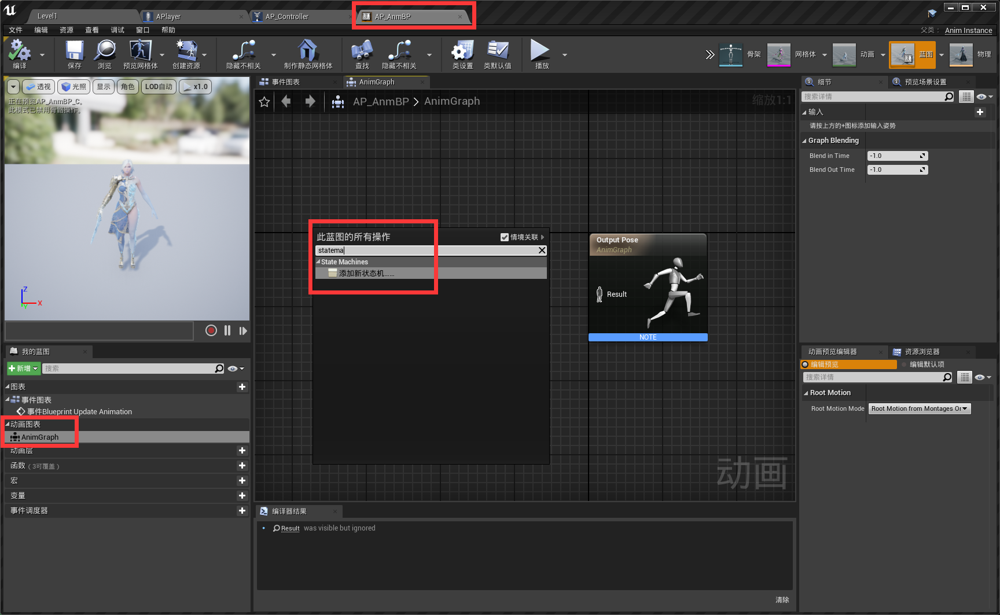
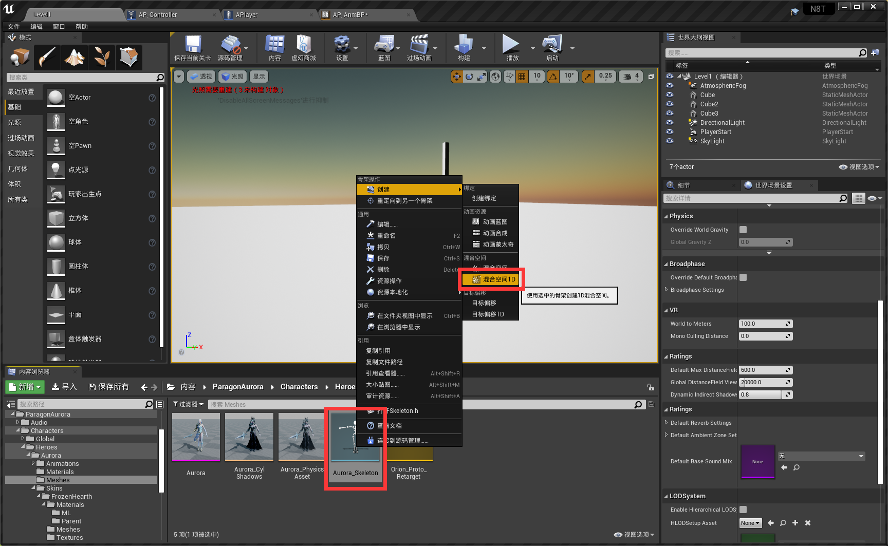
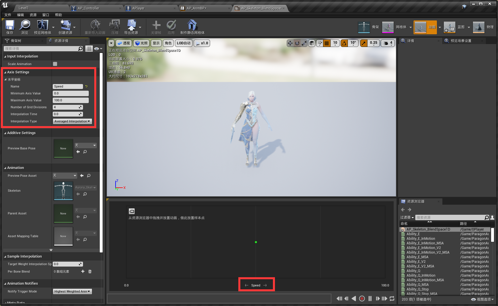
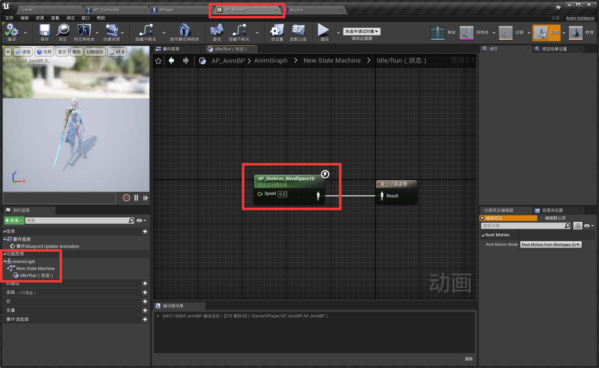
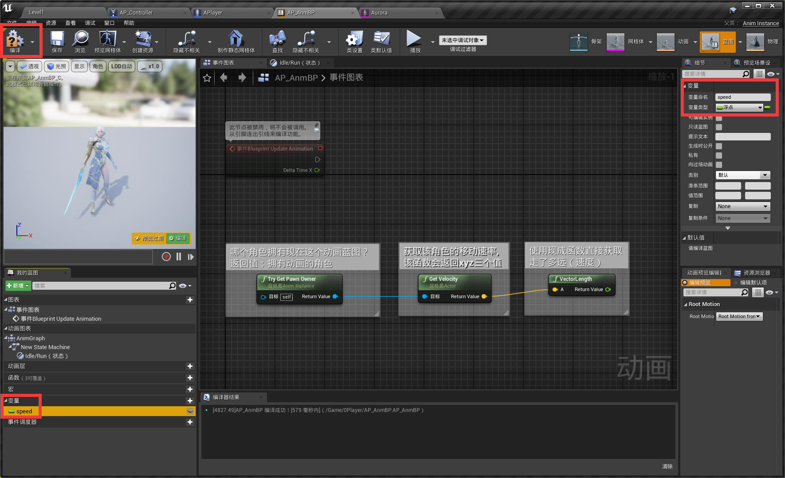
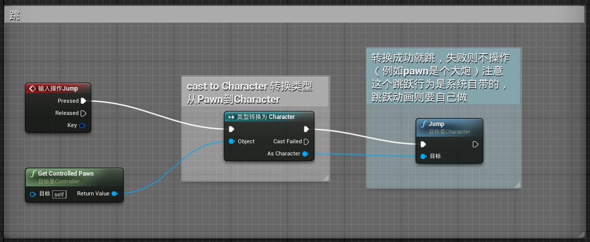
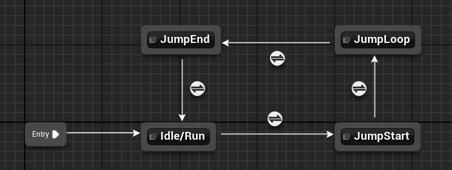
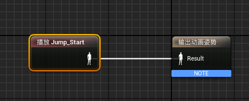
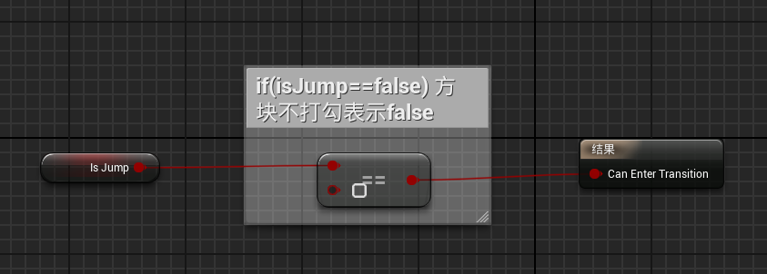
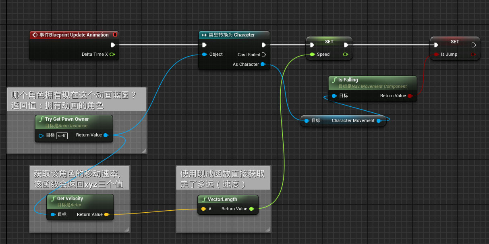

# UE4角色动画制作与绑定

### 如何定位模型并创建动画蓝图？
* 找到创建的角色，点击mesh中的放大镜按钮即可定位到模型文件目录

* 动画蓝图是创建在**模型骨架**上的（骨架可通过右键mesh文件定位到），右键骨架创建动画蓝图，重命名后将蓝图放入自己的角色文件夹中（APlayer，方便自己找）

### 如何将动画蓝图绑定到角色身上？
* 进入角色（APlayer），选择mesh组件后，注意右侧细节选项卡中的Animation模块。Animation Mode 为 Use Animation Blueprint，Anim Class 为刚才创建好的那个动画蓝图

### 制作动画蓝图
* 在动画图表（AnimGraph）中创建状态机（判断当前角色状态），将状态机连接到Output Pose上，然后制作状态机内容（之后再详述）

### 移动速度动画制作
* 在骨架文件上创建混合空间一维，重命名为'AP_Skeleton_BlendSpace1D', 将创建好的混合空间放入角色文件夹中（APlayer）

* 打开该文件，Axis Setting中
	* Name 为横坐标名，命名为Speed
	* Min/Max Axis Value为横坐标的范围 设为0和400
	* Num of Grid 为横坐标分段份数，移速动画中分4段即可

	* 系统会根据不同的速度给角色分配不同的动画
* 将不同的动画依次拖入坐标轴的各个位置 如idle放最左边，run放最右边（paragon角色中run动画叫fwd）放完后保存关闭混合空间

* 将制作好的移速混合空间文件拖入动画蓝图文件AP_AnmBP中的动画图表里，拖到刚才创建的状态机中对应idle的状态（注意是点进idle状态里 将混合空间与result连上）。

* 现在需要获取速度，将速度传给刚才设计好的混合空间，进入事件图表中，系统默认给你的Blueprint Update Animation是在游戏中不断执行的一个事件（一秒执行几十遍，在不断刷新），系统还给你了一个默认函数Try Get Pawn Owner，尝试获取当前哪个角色拥有现在这个动画蓝图。
* Try Get Pawn Owner函数写法如下，最后会输出一个Speed的数值需要传进状态机

* 但状态机是在动画图表中的（相当于另一个class了），因此需要创建变量speed用来传递参数。

* 然后将该函数拖入事件图标中，选择设置函数，然后与刚才的VectorLength连接。再将Update Anm事件的白线连接到函数设置上。（白线相当于主程序运行顺序）

* 最后进入idle状态里，将speed变量拖进去与混合空间1D相连接，至此参数成功传递进混合空间，再由混合空间输出动画姿势。大功告成！

**如何让镜头自由旋转，而角色不跟随镜头旋转？**
* 点击角色文件（APlayer）中组件最顶级那个（我命名的角色为APlayer），右侧Pawn分类，Use Controller Rotation Yaw 取消勾选。

**如何在旋转画面后再按w时，让角色朝画面面对的方向前进?**
* 点击角色文件（APlayer）中组件CharacterMovement，右侧Character Movement分类中，Orient Rotation to Movement勾上。

&nbsp;

### 跳跃动画制作
* 状态机的目的是为了区分不同的状态然后将动画传递给Output Pose，因此我们要在状态机中制作第二种状态：跳跃

* 先在角色controller的蓝图中编写Jump函数

将按下输入动作（跳跃）连接类型转换，让类型转换函数去获取当前正在控制的Pawn，然后触发系统自带的Jump动作（Jump这个移动的行为是自带的，动画则需要自己绑定）

* 回到角色动画蓝图中，状态机中跳跃的设定如下

在Idle或Run状态下时随时监测起跳条件（按空格），一旦按下空格后进入JumpStart状态（播放起跳动画），然后进入JumpLoop（循环播放空中下坠动画），检测落地后进入JumpEnd状态（播放落地动画），最后回到Idle/Run状态

* 每一条线中间的按钮就是触发条件（可理解为if语句），双击进入JumpStart前的条件按钮，为起跳动作设置条件。
* 创建一个bool变量，名为isJump与CanEnterTransmistion连接。

* 退出，再进入JumpStart状态中，从动画文件中将角色的JumpStart动画拖入该状态与Result连接，并取消勾选右侧的Loop Anm选项（起跳动作无需重复）

	

* 同理，依次将各个状态的动画放入各状态中（JumpLoop记得开启Loop），然后设置进入JumpLoop的条件为JumpStart播放完了之后（还剩0.01秒时）就进入Loop状态。

* JumpEnd进入条件为isJump为false

* 回到Idle/Run状态的条件为JumpEnd动画播放完毕(与JumpLoop的触发条件相同)

* 然后开始写isJump变量，回到动画蓝图中的事件图表，系统自带isFalling判断，用该函数判断角色是否正在下落，将Get到的Pawn转换为Character后调用isFalling函数，根据isFalling的状态去设置isJump这个布尔值。

至此，角色可以成功起跳->空中扑腾->落地

[下一章：制作动画蒙太奇](https://github.com/YiLiuNat/UnrealEngine4_Notes/blob/master/04.AnmMontage.md)

&nbsp;

[回到主目录](https://github.com/YiLiuNat/UnrealEngine4_Notes)