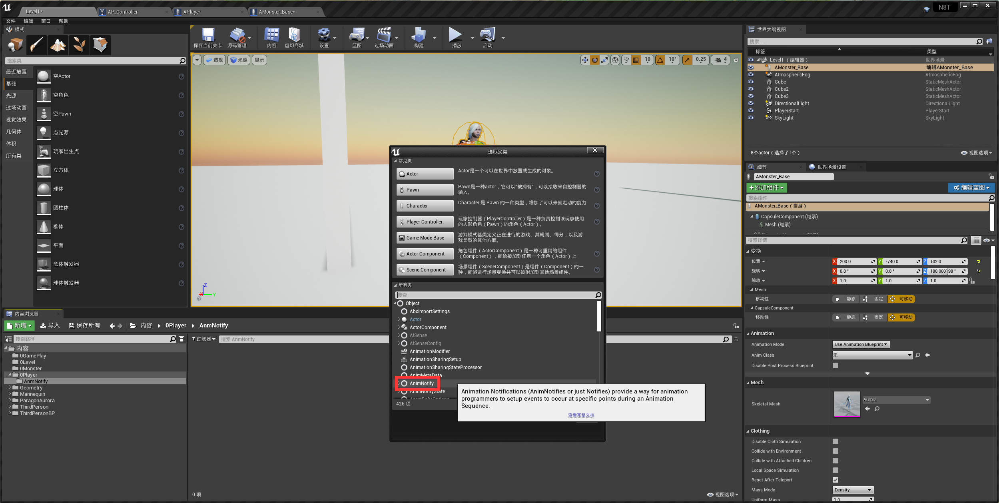
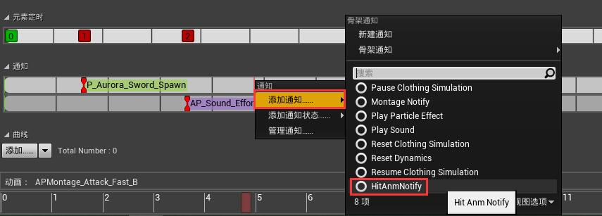
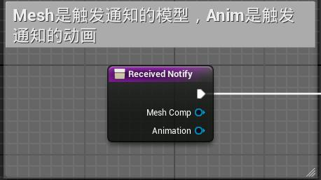
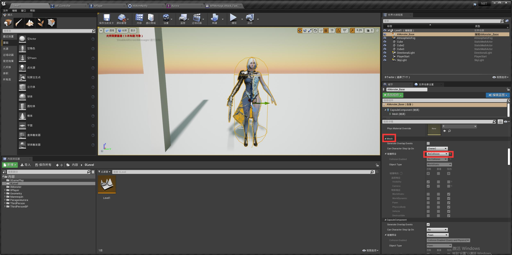

### 创建一个小怪模型
* 新文件夹建一个新的蓝图类，Character类，命名为AMonster_Base，由于是基础小怪，因此后面加个base

* 进入后选一个Mesh

### 创建打击判定（动画通知）
* 上一章讲过如何在动画中创建一条通知，除了在通知轨道上点创建，还可以在文件目录里创建新的蓝图类，然后选动画通知类

* 我们将其命名为HitAnmNotify
* 进入后我们发现其自带了两个函数（继承的父类），我们先将它们点出来（覆盖）。

* 将GetNotifyName方法的返回值起个名字，为PlayerHit

* 此时回到动画的通知轨中，可以创建刚才添加的自定义通知了，这样的通知是每次添加时都可以重复使用的，并且不用再到动画蓝图里去做接受通知的事件了，可以直接在这个文件里面做。

* 在攻击动作的合适位置添加通知（打击判定）后，进入该文件，当动画触发通知时，ReceivedNotify函数就会触发。

* 在APlayer事件图表中创建一个新的自定义事件CheckAttackHit 检测攻击碰撞。

* 在ReceivedNotify中创建如下

* 然后回到APlayer中，完善刚才的CheckAttackHit，首先获取碰撞球体的坐标，碰撞球体需要在角色的前方，因此根据Actor的坐标偏移获得，然后连接球体碰撞器（碰撞对象为Pawn），碰撞器返回的值将是PlayHit后碰撞到的所有物体（一个数组）。

再将碰撞后的每一个物体进行遍历，判断是否为Monster，如果是则造成伤害。

* 由于我们现在的写法还很粗糙，一个角色有多个碰撞体，一次攻击动作会造成与多个碰撞体的触发，因此先把mesh碰撞设为no collision，（胶囊还是有碰撞的）这样即可避免。
