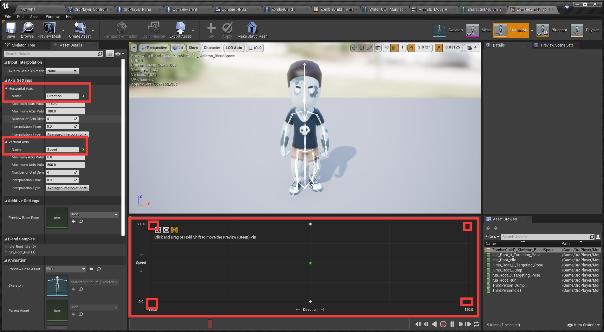
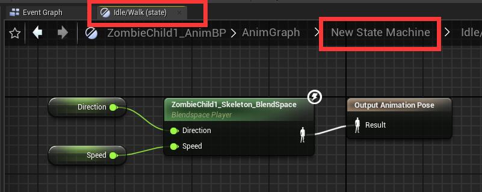
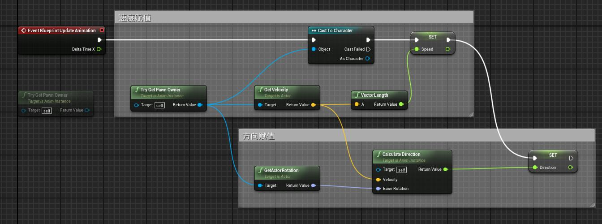
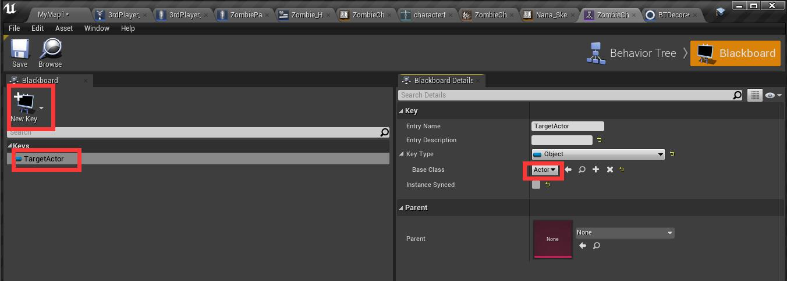
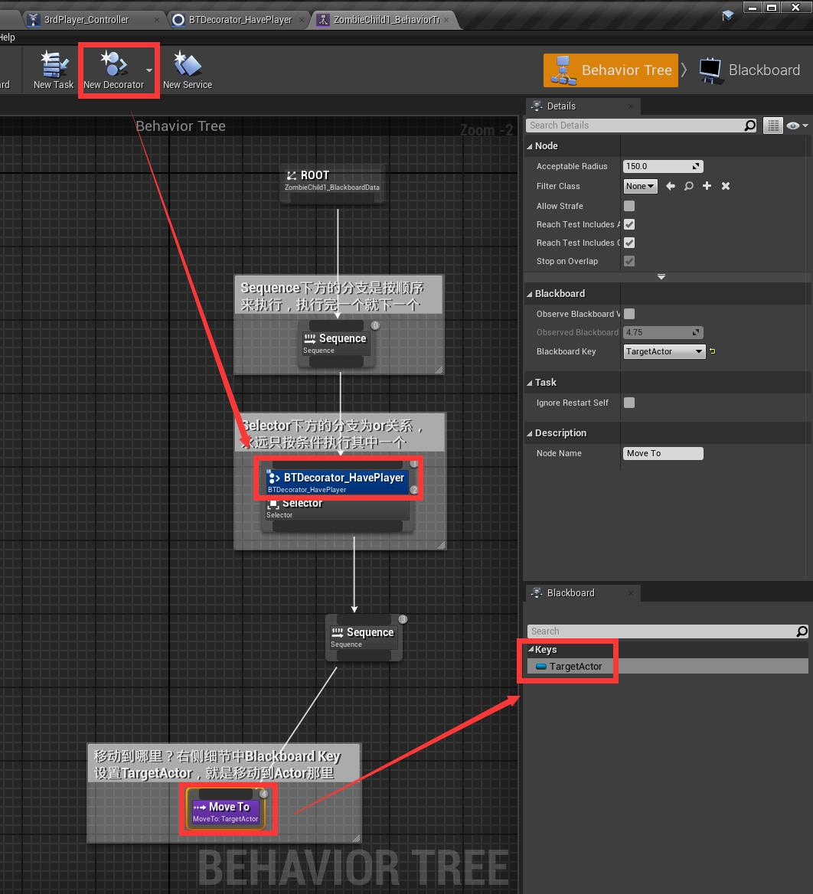
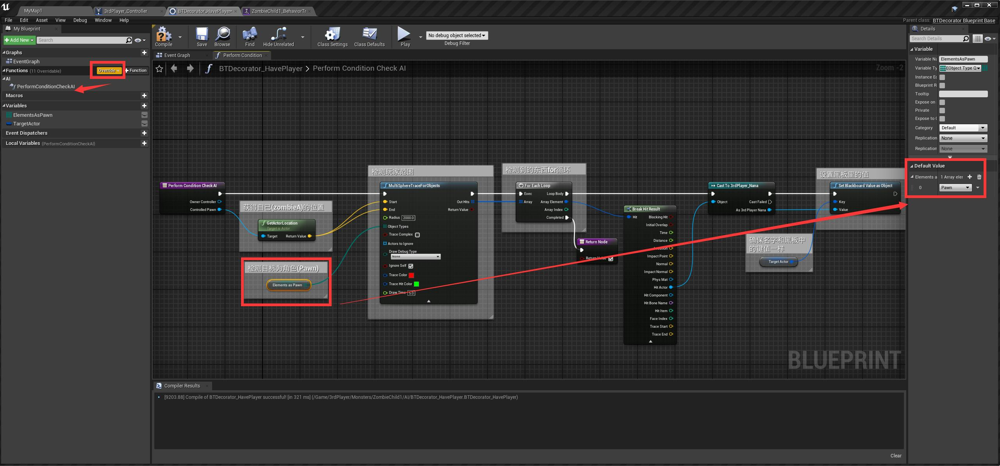
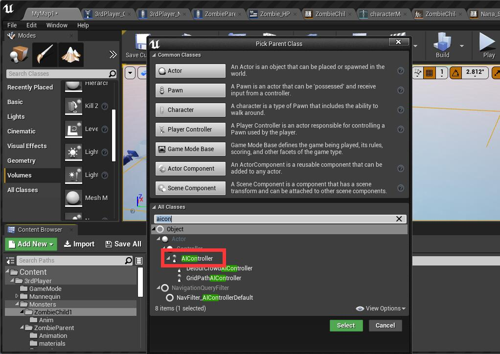
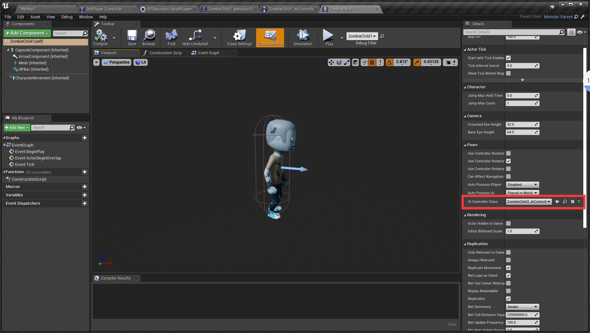

### 创建小怪AI

* 在基础小怪上创建子蓝图来做各个不同的小怪
* 在其骨骼上创建新的动画蓝图
* 动画蓝图中创建新的状态机和插槽  

### 制作小怪前后左右走
* 右键小怪骨骼创建混合空间

* 二维混合空间中纵轴是速度，横轴是人物旋转的方向（-180度到180度）
* 但由于我没有人物左走右走的动画，就只放idle和run的动画了
* 在动画蓝图的状态机中一样加入idle/walk，在idle/run中放入混合空间以及提升速度方向2个变量

* 在动画蓝图中写如下来赋值速度和方向给状态机

* 在场景中放入Nav Mesh Bounds来限定小怪走路范伟，拉到你想要的大小，然后**按P**，范围就会变绿，这是小怪会走的区域

### 编写AI
* 在小怪目录中右键人工智能-> 分别创建黑板和行为树。
* 打开行为树，与黑板绑定在一起

* 在黑板中新建一个键值暂且命名为TargetActor，类型为Object，**BaseClass为Actor**。

* 行为树中，MoveTo右侧的Blackboard Key为刚才建的TargetActor。然后再创建装饰器，创建好的装饰器会以文件形式出现在目录中，重命名一下然后右键Selector添加创建好的装饰器。

* 装饰器中写如下，注意2点，一是不要直接在EventGraph中写，要在Functions中拉一个新的PerformConditionCheckAI里面去写。二是Element as Pawn的数组中元素为pawn。

#### 将行为树与小怪绑定
* 在文件夹创建AIController

* AIController中运行刚才写的行为树

* 小怪蓝图中选择AIController
